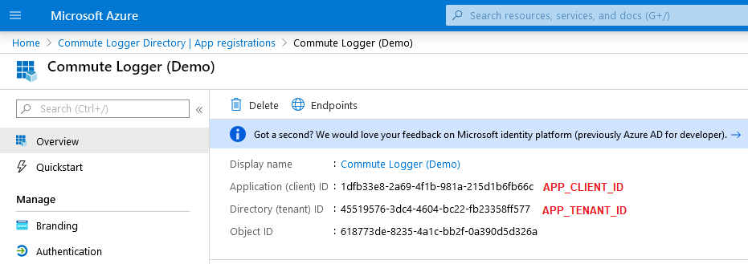
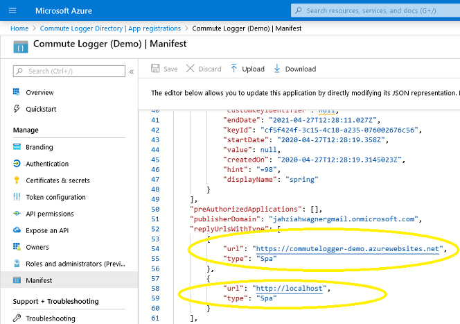
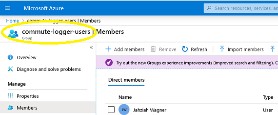

# Commute Logger
[](https://dev.azure.com/commutelogger-demo/commutelogger/_build/latest?definitionId=10&branchName=master)

Commute Logger is a web application for tracking daily commute in organizations.

## How to run
`$ docker-compose up -d -e APP_TENANT_ID=<tenant-id> -e APP_CLIENT_ID=<client-id> -e APP_CLIENT_SECRET=<client-secret> -e APP_ALLOWED_GROUPS=<allowed-groups'> -e APP_REDIRECT_URI=<redirect-uri>`

Demo for bytelope.com:

docker-compose up -d --env-file ./test.env

App is served on [http://localhost](http://localhost).

### Variables
* `APP_TENANT_ID` is the tenant id for your Azure AD App.
* `APP_CLIENT_ID` is the client id for your Azure AD App.
* `APP_CLIENT_SECRET` is the client secret for your Azure AD App, required for requesting an on-behalf-of token.
* `APP_ALLOWED_GROUPS` is the allowed groups for your Azure AD App. Delimiter is comma e.g. `GroupA, GroupB`. 
* `APP_REDIRECT_URI` is the redirect uri for your Azure AD App. This will differ depending on environment.

## How to deploy
### Azure Active Directory
1. Follow [Quickstart: Register an application with the Microsoft identity platform](https://docs.microsoft.com/en-us/azure/active-directory/develop/quickstart-register-app) to create App Registration in Azure AD. Note that ID tokens must be enabled (implicit grant).

2. In your app registration, copy down `APP_CLIENT_ID` and `APP_TENANT_ID` as seen below.


3. Follow [MSAL.js 2.0 Documentation](https://github.com/AzureAD/microsoft-authentication-library-for-js/tree/dev/lib/msal-browser#prerequisites) to configure app registration MANIFEST. Copy down local/remote redirect url as `VUE_APP_REDIRECT_URI`.


4. Create or use an existing group of allowed users and copy down its name for `APP_ALLOWED_GROUPS`.


5. (Optional) Configure Logout URL in Azure AD App > Authentication. 

6. (Optional) Create Client Secret in Azure AD App > Certificates & secrets, set by `APP_CLIENT_SECRET`. 

### App Service
A single instance app service for linux containers must be setup, for information on how to do this see [Microsoft App Service on Linux documentation](https://docs.microsoft.com/en-us/azure/app-service/containers/).

### Data source
Configure data source through the following environment variables:
``` 
DATASOURCE_URL: "jdbc:postgresql://database:5432/"
DATASOURCE_USERNAME: "postgres"
DATASOURCE_PASSWORD: "1234"
```

Note: Only postgres JDBC driver is present on classpath.

## Development
See [backend documentation](./backend/README.md) and [frontend documentation](./frontend/README.md) for more information.

## Related links
* [Azure DevOps Project](https://dev.azure.com/commutelogger-demo/_git/commutelogger)
* [Commute Logger Website](http://commutelogger-frontend.azurewebsites.net/)


